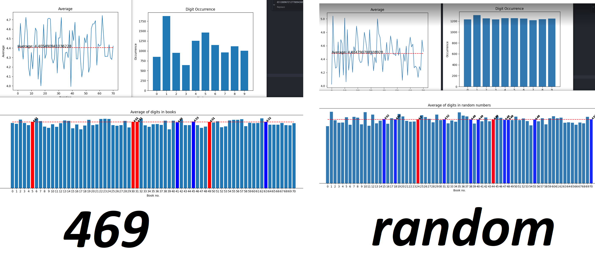

## About
Bacca Chewie article about [The Hellgate's Averages](https://tibiasecrets.com/article.php?id=166), resolves around average of digits per book is around 4.5

This is close to random distribution of nubmers 0..9 / 10 = 4.5

## Theory

If this is true, the random generated string of numbers should show 4.5

## Run

To show 469 analysis just run `python results.py` to display the 3 graphs as shown on above screen.

Inside `results.py` you can comment in/out different approaches.

## Conclusion

While the average from all books shown is around 4.4, there are books really close to 4.5 that are marked on red. Meaning they are almost equal to normal distribution. Meaning they potentialy could be randomly generated. Other books aren't that close to it however.

Other fact is that the books itself contain repetitions. The 4.4 is present, but the occurence graph shows something far different from the normal distribution as shown on occurence graph. This could be bound to the fact the book contains repetitions, while randomly generated string doesnt offer that mechanic.

